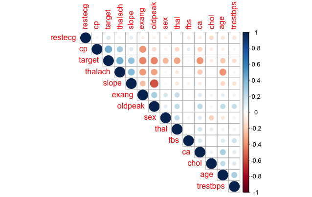
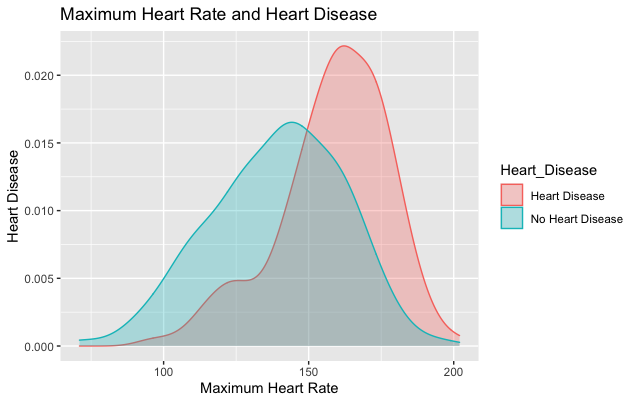
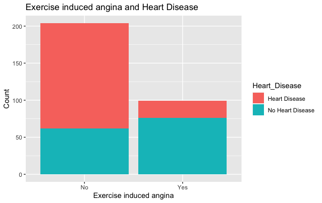

<h1 align="center">Heart Disease</h1>

# Content 
1. [Introduction](#intr)
2. [Aim](#aim)
3. [Objectives](#objective)
4. [Installation](#instal)
5. [Data Visualisation](#visual)
6. [Methods](#methods)
7. [Results](#res)
8. [References](#ref)

# Introduction 
Cardiovascular disease (CVD) is a leading cause of death worldwide. According to the World Health Organisation (WHO), 17.9 million people died in 2019, accounting for 32% of deaths worldwide. Most deaths (85%) from CVD were due to heart attack and stroke ("Cardiovascular diseases (CVDs)", 2021). CVD is also divided into four groups:  coronary artery disease (CAD), which is also referred to as coronary heart disease (CHD), cerebrovascular disease, peripheral artery disease (PAD), and aortic atherosclerosis (Lopez, Ballard & Jan, 2021). 
Atherosclerosis occurs due to narrowing of the arteries due to plaque build-up. Atherosclerosis is characterized by the accumulation of lipids and fibrous elements in the large arteries and is the primary cause of heart disease and stroke (Lusis, 2000). 

Many risk factors lead to the development of the CVD: 

1. Age

2. Sex

3. Smoking

4. Genetics 

5. Alcohol consumption

6. Physical inactivity 

7. Diet 

8. Environmental Factors

When a person comes to the doctor, the first step is the risk assessment, where a GP asks about your medical and family history, checks blood pressure, and does a blood test to check the cholesterol levels. Any further tests include: ECG, exercise stress test, X-rays, echocardiogram, coronary angiography, radionuclide tests, MRI scans, CT scans. 

# Aim of the project
To visualise data and train different machine learning algorithms (MLAs) and assess their accuracy. 

# Objectives: 

1. Investigate correlation between variables

2. Divide data into training and test sets

3. Train MLAs

# Installation 
1. The data set provided on the https://www.kaggle.com/ronitf/heart-disease-uci 

2. Save the csv file in the project working directory

3. Import dataset into the RStudio. 

# Data Visualisation 
The dataset contains 14 variables: 

 1.Age 
 
 2.Sex 
 
 3.Chest pain type (4 values) 
 
 4.Resting blood pressure 
 
 5.Serum cholestoral in mg/dl 
 
 6.Fasting blood sugar > 120 mg/dl
 
 7.Resting electrocardiographic results (values 0,1,2)
 
 8.Maximum heart rate achieved 
 
 9.Exercise induced angina 
 
 10.Oldpeak = ST depression induced by exercise relative to rest 
 
 11.The slope of the peak exercise ST segment 
 
 12.Number of major vessels (0-3) colored by flouroscopy 
 
 13.Thalassemia: 3 = normal; 6 = fixed defect; 7 = reversible defect
 
All patients names and identification numbers were removed due to Data Protection Act.

<figcaption align = "center"><b>Fig.1 - Correlation of variables with each other. Target (Heart Disease) strongly correlates with maximum heart rate (thalach) and the slope of the peak exercise ST segment (slope).</b></figcaption>

<figcaption align = "center"><b>Fig.2 - The higher the maximum heart rate achieved the higher chance of getting a heart disease. Increased heart rate is strongly associated with coronary heart disease.</b></figcaption>

The lowest correlation was seen between the target and the exercise induced angina (exang) (Fig. 1).

<figcaption align = "center"><b>Fig.3 - Angina can appear in the response to the physical activity, emotional stress, or exposure to cold temperatures, or after big meals. Therefore, there is small correlation between Heart Disease and Angina, however, angina is the symptom of the heart disease.</b></figcaption>

# Methods
In this research we will use several machine learning algorithms (MLA), such as linear regression, random forests, naive Bayes, decision tree and k-nearest neighbors with cross-validation. All MLAs have their advantages and disadvantages. 
1. Logistic regression 
2. Random Forests 
3. Naive Bayes
4. Decision Tree
5. K-nearest neighbors

# Results

| Model                | Accuracy (%)  |
| -------------------- | ------------- |
| Random Forest        | 83.51648      |
| Logistic Regression  | 82.41758      |
| Decision  Tree       | 74.72527      |
| Knn                  | 69.23077      |
| Naive Bayes          | 59.34066      |

# References 

1. Cardiovascular diseases (CVDs). (2021). Retrieved 6 November 2021, from https://www.who.int/news-room/fact-sheets/detail/cardiovascular-diseases-(cvds)

2. Irizarry, R. (2021). Introduction to Data Science. Retrieved 9 November 2021, from https://rafalab.github.io/dsbook/

3. Lopez, E., Ballard, B., & Jan, A. (2021). Cardiovascular Disease. Statpearls.

4. Lusis, A. (2000). Atherosclerosis. Nature, 407(6801), 233-241. doi: 10.1038/35025203

5. Prediabetes - Diagnosis and treatment - Mayo Clinic. (2021). Retrieved 6 November 2021, from https://www.mayoclinic.org/diseases-conditions/prediabetes/diagnosis-treatment/drc-20355284

6. Rodgers, J., Jones, J., Bolleddu, S., Vanthenapalli, S., Rodgers, L., & Shah, K. et al. (2019). Cardiovascular Risks Associated with Gender and Aging. Journal Of Cardiovascular Development And Disease, 6(2), 19. doi: 10.3390/jcdd6020019

7. Wakabayashi, I. (2017). Gender differences in cardiovascular risk factors in patients with coronary artery disease and those with type 2 diabetes. Journal Of Thoracic Disease, 9(5), E503-E506. doi: 10.21037/jtd.2017.04.30

8. Wood, J. (2009). Cardiac Complications in Thalassemia Major. Hemoglobin, 33(sup1), S81-S86. doi: 10.3109/03630260903347526

